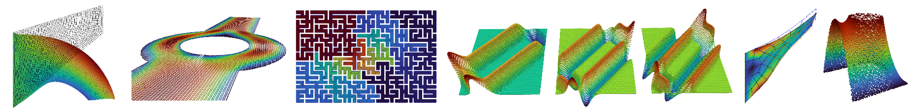
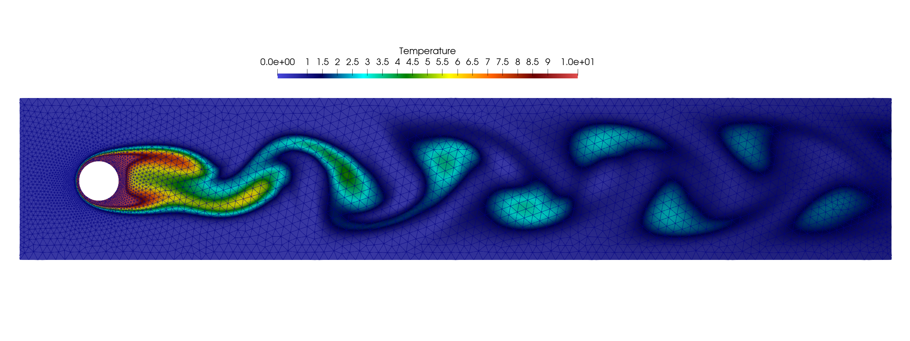

Welcome to the documentation of AutoPDEx!
=========================================

`AutoPDEx <https://github.com/BodeTobias/AutoPDEx>`_ is a free open source partial differential equation (PDE) solver based on the automatic code transformation capabilities of `JAX <https://github.com/google/jax>`_.

The idea of the project is to develop a modular and easily extendable environment for the solution of boundary and initial boundary value problems, which allows for good integration with machine learning algorithms and can be executed on accelerators such as GPUs.

The highest level of abstraction is the :class:`autopdex.SimState` interface.
It orchestrates complete simulations from mesh import and field definitions to model registration, boundary conditions, time integration and postprocessing.
For more control, the medium-level modules such as 'solver', 'dae' and 'models' can be directly accessed.
They operate on the `static_settings` and `settings` dictionaries and call lower-level modules such as the assembler.
These lower-level modules can also be accessed directly, for example to assemble a global residual or tangent matrix.

Installation
____________

To install AutoPDEx, you can use the following command. Note, that it requires python>=3.10. 

.. code-block:: bash

   pip install --upgrade pip
   pip install autopdex

Or with all optional dependencies:

.. code-block:: bash

   pip install autopdex[dev]

To use the Intel MKL Pardiso and PETSc solvers, they have to be installed by the user.

.. toctree::
   :maxdepth: 1

   notebooks/quickstart_hli

.. toctree::
   :maxdepth: 1
   :caption: High-level interface

   sim_state

.. toctree::
   :maxdepth: 1
   :caption: Examples

   example_notebooks
   examples

.. toctree::
   :maxdepth: 1
   :caption: Lower level modules

   dae
   solver
   models
   settings
   assembler
   implicit_diff
   spaces
   solution_structures
   variational_schemes
   geometry
   seeder
   utility
   plotter
   mesher

Contributions
_____________

You are warmly invited to contribute to the project. For larger developments, please get in touch beforehand in order to circumvent double work. 

For detailed information on how to contribute, please see the `Contribution Guidelines <https://github.com/BodeTobias/AutoPDEx/blob/main/CONTRIBUTING.md>`_.

License
_______

AutoPDEx is licensed under the GNU Affero General Public License, Version 3.

.. toctree::
   :maxdepth: 1
   :caption: Source code
   :hidden:

   GitHub Project <https://github.com/BodeTobias/AutoPDEx>

Index
_____

* :ref:`genindex`
