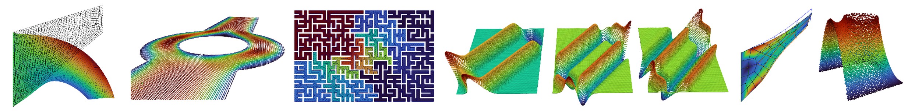

Welcome to AutoPDEx's documentation!
====================================

`AutoPDEx <https://github.com/BodeTobias/AutoPDEx>`_ is a free open source partial differential equation (PDE) solver based on the automatic code transformation capabilities of `JAX <https://github.com/google/jax>`_.

The idea of the project is to develop a modular and easily extendable environment for the solution of boundary and initial boundary value problems, which allows for good integration with machine learning algorithms and can be executed on accelerators such as GPUs.

The highest level of abstraction is the solver module, which includes different solution algorithms such as the Newton-Raphson method, adaptive load step control and nonlinear minimizers, and leverages different backends. 
To solve problems, two dictionaries (`static_settings` and `settings`) are particularly needed, in which the problem settings are specified. 
Part of the static settings includes the definition of the model in the form of a JAX-transformable function, which returns a strong or weak form of a PDE or user-specific potentials, residuals and tangents. 
Some pre-made models are included in the models module.
The solver module, in turn, calls functions from lower-level modules, as e.g. the assembler. These can also be accessed directly, for example, to assemble the global residual or a tangent matrix.

Installation
____________

To install AutoPDEx, you can use the following command. Note, that it requires python>=3.10. 

.. code-block:: bash

   pip install --upgrade pip
   pip install autopdex

To use the Intel MKL Pardiso and PETSc solvers, they have to be installed by the user.

.. toctree::
   :maxdepth: 1

   notebooks/quickstart

.. toctree::
   :maxdepth: 2
   :caption: High level operations

   solver
   models

.. toctree::
   :maxdepth: 1
   :caption: Settings
   
   settings

.. toctree::
   :maxdepth: 1
   :caption: Examples

   example_notebooks
   examples

.. toctree::
   :maxdepth: 1
   :caption: Lower level operations

   assembler
   implicit_diff
   spaces
   solution_structures
   variational_schemes

.. toctree::
   :maxdepth: 1
   :caption: Pre- and postprocessing

   geometry
   seeder
   utility
   plotter

Contributions
_____________

You are warmly invited to contribute to the project. For larger developments, please get in touch beforehand in order to circumvent double work. 

License
_______

AutoPDEx is licensed under the GNU Affero General Public License, Version 3.

.. toctree::
   :maxdepth: 1
   :caption: Source code
   :hidden:

   GitHub Project <https://github.com/BodeTobias/AutoPDEx>

Index
_____

* :ref:`genindex`
