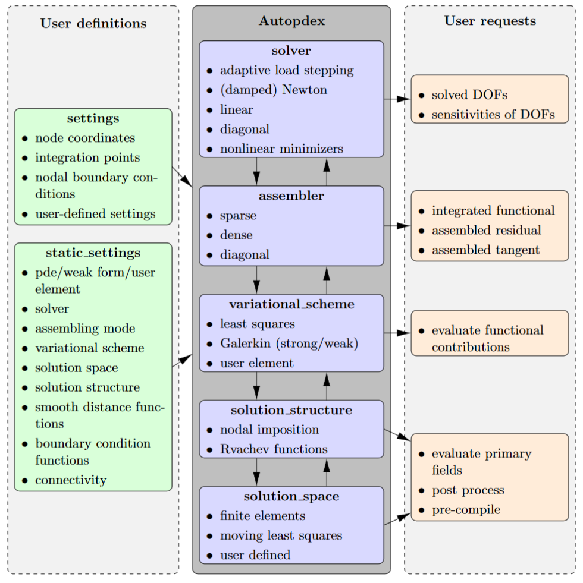

Solver
======

.. automodule:: autopdex.solver
    :no-index:

Automatic Solvers
-----------------

.. autosummary::
   :toctree: _autosummary

   adaptive_load_stepping
   solver

Specific solvers
----------------

.. autosummary::
   :toctree: _autosummary

   solve_nonlinear_minimization
   solve_linear
   solve_diagonal_linear
   solve_newton
   solve_damped_newton

Linear Solvers for Different Backends
-------------------------------------

.. autosummary::
   :toctree: _autosummary

   linear_solve_jax
   linear_solve_petsc
   linear_solve_pardiso
   linear_solve_pyamg
   linear_solve_scipy

Iterative Solvers/Smoothers
---------------------------

.. autosummary::
   :toctree: _autosummary

   jacobi_method
   damped_jacobi_relaxation

Utility Functions
-----------------

.. autosummary::
   :toctree: _autosummary

   scipy_assembling